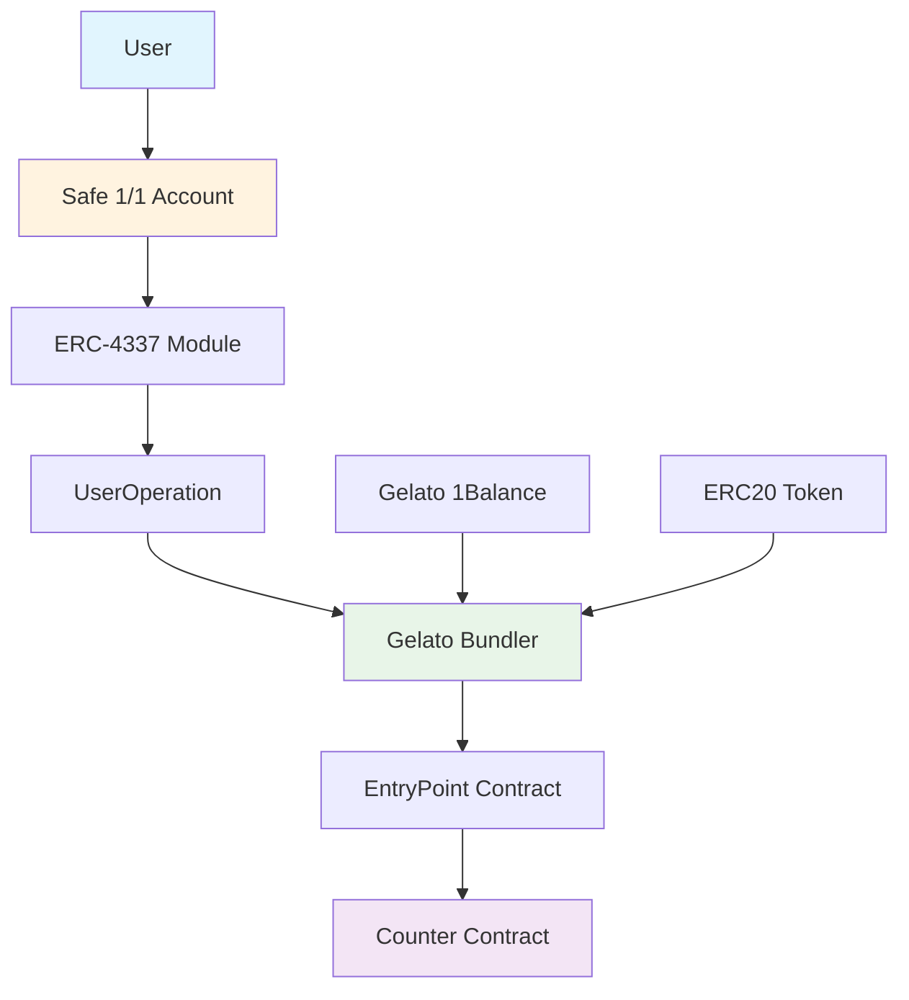

# ERC-4337 Safe Gelato Demo

[](https://eips.ethereum.org/EIPS/eip-4337)
[](https://docs.gelato.network/)
[](https://docs.safe.global/)
[](https://docs.soliditylang.org/)
[](https://github.com/)
[](https://www.typescriptlang.org/)
[](https://opensource.org/licenses/MIT)

A complete implementation of ERC-4337 (Account Abstraction) using Safe 1/1 with ERC4337 module and Gelato Bundler integration. This project demonstrates three types of UserOperations: Sponsored (1Balance), Native ETH, and ERC20 token payments.

## Project Status

**COMPLETE** - 3/3 UserOperations fully implemented + 1 bonus

## Deployed Contracts

### Core Contracts
- **Safe 1/1 with ERC4337 module**: [`0xA99187fbBdbE75AD71710830B29d8a0a3eE90d17`](https://sepolia.etherscan.io/address/0xA99187fbBdbE75AD71710830B29d8a0a3eE90d17)
- **Counter Contract**: [`0x23f47e4f855b2e4f1bbd8815b333702c706318e0`](https://sepolia.etherscan.io/address/0x23f47e4f855b2e4f1bbd8815b333702c706318e0)
- **TestToken ERC20**: [`0x0566F0CD850220DF2806E3100cc6029144af7041`](https://sepolia.etherscan.io/address/0x0566F0CD850220DF2806E3100cc6029144af7041)

### Current State
- **Counter Value**: 25 (execution proof)
- **3/3 UserOperations** implemented (3 required + 1 bonus)

## Quick Start

### Prerequisites
- Node.js 18+
- npm or pnpm
- Sepolia ETH for gas fees
- Gelato API key for sponsored transactions

### Installation
```bash
git clone <repository-url>
cd erc4337-safe-gelato-demo
npm install
```

### Environment Setup
Copy `.env.example` to `.env` and configure:
```bash
PRIVATE_KEY=0x...                    # Your private key
RPC_URL=https://sepolia.infura.io/... # Sepolia RPC URL
GELATO_API_KEY=your_gelato_api_key   # For sponsored transactions
```

**Detailed setup guide**: See **[docs/ENV_SETUP.md](./docs/ENV_SETUP.md)** for complete environment configuration instructions.

### Run UserOperations
```bash
# Primary Implementation (3/3 Functional)
npm run safe4337-sponsored-gelato-sdk    # Sponsored (Gelato pays gas)
npm run safe4337-native-gelato-sdk       # Native (Safe pays gas)
npm run safe4337-erc20-starter           # ERC20 (Safe pays with tokens)

# Deployed Safe Implementation (1/3 Functional)
npm run safe4337-sponsored-correct       # Sponsored with deployed Safe 1/1

# Technical Bonus
npm run test-safe-4337-pack              # Safe4337Pack compatibility test
```

## Architecture

### System Overview



### Key Features
- **Safe 1/1 with ERC4337 Module** - Native Safe account abstraction
- **Dual Implementation Approach** - Both SDK examples and deployed Safe approaches
- **Gelato Smart Wallet SDK** - Direct integration for sponsored and native UserOperations
- **Safe Starter Kit SDK** - ERC20 UserOperation integration
- **Gelato Bundler Integration** - Professional bundler API usage
- **Multiple SDK Integration** - Demonstrates architectural flexibility
- **TypeScript** - Full type safety and modern development practices

**Architectural decisions**: See **[docs/ARCHITECTURAL_DECISIONS.md](./docs/ARCHITECTURAL_DECISIONS.md)** for detailed rationale behind technology choices.

### Working UserOperations (3/3 Required + 1 Bonus)

#### Primary Implementation (3/3 Functional)
1. **Sponsored** - ✅ Gelato 1Balance pays gas fees (Gelato SDK creates new Safe)
2. **Native** - ✅ Safe 1/1 pays gas fees directly (Gelato SDK creates new account)
3. **ERC20** - ✅ Safe 1/1 pays gas fees using ERC20 tokens (Safe Starter Kit creates new Safe)

#### Deployed Safe Implementation (1/3 Functional)
1. **Sponsored** - ✅ Uses the deployed Safe 1/1 (direct API approach)
2. **Native** - ❌ Failed due to Safe 4337 module deployment issues
3. **ERC20** - ❌ Failed due to API configuration issues

### Technical Bonus: Additional Implementation
**Additional Script**: `test-safe-4337-pack.ts` - Safe4337Pack compatibility verification
- **Purpose**: Verifies Safe 1/1 with ERC4337 module works with Safe4337Pack SDK
- **Demonstrates**: Configuration validation and SDK integration testing
- **Value**: Confirms infrastructure setup and SDK compatibility

**Bonus UserOperation**: `safe4337-sponsored.ts` - Direct Gelato API implementation
- **Purpose**: Alternative approach using direct Gelato Bundler API
- **Demonstrates**: Multiple implementation strategies
- **Value**: Shows flexibility in ERC-4337 integration approaches

**Technical details**: See **[docs/TECHNICAL_DETAILS.md](./docs/TECHNICAL_DETAILS.md)** for implementation specifics and **[docs/SCRIPT_ARCHITECTURE.md](./docs/SCRIPT_ARCHITECTURE.md)** for script organization.

## Documentation

### Core Documentation
*   **[README.md](./README.md)** - Project overview and quick start guide
*   **[docs/SUBMISSION_REPORT.md](./docs/SUBMISSION_REPORT.md)** - Complete project report with challenges, solutions, and lessons learned
*   **[docs/TECHNICAL_DETAILS.md](./docs/TECHNICAL_DETAILS.md)** - Technical analysis and implementation details
*   **[docs/TRANSACTIONS.md](./docs/TRANSACTIONS.md)** - Transaction history and contract addresses

### Architecture & Decisions
*   **[docs/ARCHITECTURAL_DECISIONS.md](./docs/ARCHITECTURAL_DECISIONS.md)** - Key architectural decisions and rationale
*   **[docs/SCRIPT_ARCHITECTURE.md](./docs/SCRIPT_ARCHITECTURE.md)** - Script organization and factorization choices
*   **[docs/SCRIPT_STATUS.md](./docs/SCRIPT_STATUS.md)** - Status of all scripts (functional, failed, legacy)

### Setup & Configuration
*   **[docs/ENV_SETUP.md](./docs/ENV_SETUP.md)** - Environment configuration guide

## Sources & Inspiration

### Official Gelato Documentation & Resources
- **[Gelato Smart Wallets Documentation](https://docs.gelato.cloud/Smart-Wallets/introduction/Overview)** - Official guide covering EIP-7702 and ERC-4337 standards
- **[Gelato Smart Wallet SDK Examples](https://github.com/gelatodigital/how-tos-1-smartwallet-sdk-examples)** - Comprehensive examples for Safe, Kernel, and custom smart wallets
- **[Gelato Bundler API Endpoints](https://github.com/gelatodigital/how-to-use-bundler-api-endpoints)** - Complete collection of scripts demonstrating Gelato's Account Abstraction bundler API endpoints
- **[Gelato Documentation](https://docs.gelato.network/)** - Complete Gelato infrastructure documentation
- **[Gelato Smart Wallet SDK](https://docs.gelato.cloud/Smart-Wallets/SDK/)** - Official SDK for smart wallet integration
- **[Gelato Community](https://discord.gg/gelato)** - Discord community for support and discussions

### Key Gelato Examples Referenced
The [Gelato Smart Wallet SDK Examples](https://github.com/gelatodigital/how-tos-1-smartwallet-sdk-examples) repository provided crucial implementation patterns for:
- **Safe-sponsored transactions** - Direct inspiration for our Safe 1/1 implementation
- **Native payment methods** - Gas estimation and transaction patterns
- **ERC20 token payments** - Token transfer implementations
- **Gas estimation techniques** - Pre-transaction cost analysis

The [Gelato Bundler API Endpoints](https://github.com/gelatodigital/how-to-use-bundler-api-endpoints) repository demonstrated:
- **Direct bundler integration** - Manual UserOperation construction
- **API endpoint usage** - Proper request formatting and error handling
- **Chain configuration** - Multi-network support patterns

### Additional Resources
- **[ERC-4337 Specification](https://eips.ethereum.org/EIPS/eip-4337)** - Official Account Abstraction standard
- **[Safe Documentation](https://docs.safe.global/)** - Safe 1/1 deployment and configuration
- **[Viem Documentation](https://viem.sh/)** - TypeScript interface for Ethereum
- **[Ethers.js Documentation](https://docs.ethers.org/)** - JavaScript library for Ethereum

## DevRel Value

This project demonstrates:
- **Technical Excellence** - Complete ERC-4337 implementation
- **Problem Solving** - Systematic blocker resolution methodology
- **Architectural Decisions** - Practical tool selection and implementation
- **Documentation Quality** - Professional documentation standards
- **Code Organization** - Clean, maintainable architecture

**Complete analysis**: See **[docs/SUBMISSION_REPORT.md](./docs/SUBMISSION_REPORT.md)** for comprehensive project analysis, challenges encountered, and lessons learned.

## Project Metrics

- **UserOperations**: 3/3 functional (required) + 1 robustness test (bonus)
- **Safe Integration**: Native Safe 1/1 with ERC4337 module
- **SDK Usage**: Gelato Smart Wallet SDK + Safe Starter Kit
- **Documentation**: 8 comprehensive documents
- **Code Quality**: TypeScript with full type safety

**On-chain proof**: See **[docs/TRANSACTIONS.md](./docs/TRANSACTIONS.md)** for all deployed contracts and transaction history.

## Common Errors & Solutions

### "AA20 account not deployed"
- **Cause**: Safe 4337 module not properly deployed or initialized
- **Solution**: Use SDK examples that create new accounts, or verify Safe deployment

### "Too Many Requests" from Infura
- **Cause**: Rate limiting on RPC endpoint
- **Solution**: Use alternative RPC providers or implement retry logic

### "Invalid query parameters" for ERC20
- **Cause**: API configuration issues with Gelato Paymaster
- **Solution**: Use Safe Starter Kit SDK for ERC20 UserOperations

### "Safe4337Pack not found"
- **Cause**: SDK compatibility issues
- **Solution**: Use alternative SDKs (Gelato Smart Wallet SDK, Safe Starter Kit)

## Known Limitations

- **No UserOperation Batching** - Each UserOperation is sent individually
- **No Custom Paymaster** - Uses Gelato's 1Balance and Safe Starter Kit paymasters
- **No Local Bundler** - Relies on Gelato's hosted bundler service
- **Limited Account Types** - Focuses on Safe 1/1, not Kernel or other account types
- **Testnet Only** - Deployed on Sepolia testnet for demonstration purposes

## Future Improvements

- **UserOperation Batching** - Implement batch UserOperations for gas efficiency
- **Custom Paymaster** - Deploy and configure custom paymaster contracts
- **Local Bundler** - Set up local bundler for development and testing
- **Multiple Account Types** - Support Kernel, Biconomy, and other account types
- **Production Deployment** - Deploy on mainnet with proper security measures

---

**Status**: **PROJECT COMPLETE** - Ready for submission and review
